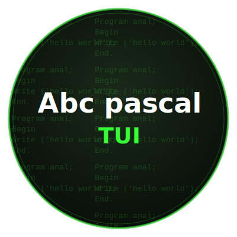

[](README_UA.md) [](README_RU.md)

---

<p align="center">
  
</p>

## DESCRIPTION

abc-pascal-tui is an IDE for Pascal based on the PascalABC.NET compiler, utilizing a Python-based TUI (Text User Interface).

## DOWNLOAD

To download the IDE, you must first install Python, Mono, Git, and the Textual library. DotNet isn't necessary yet (it's needed to run binaries that don't work properly on Mono).

<p align="center">
  
</p>

<p align="center">
  
</p>

---

# Instructions for Termux

```bash
pkg install mono -y
```

```bash
pkg install python -y
```

```bash
pkg install git -y
```

```bash
pip install textual
```

(It is advisable to download DotNet, but not necessary.)
```bash
pkg install dotnet-runtime-8.0
```

```bash
git clone https://github.com/kuzmak161-creator/abc-pascal-tui
```

```bash
cd abc-pascal-tui
```

Launch:
```bash
python tui.py
```

---

# Instructions for Debian

(Only tested with ARM versions.)

```bash
sudo apt install mono-complete 
```

```bash
sudo apt install git -y
```

```bash
sudo apt install python3 -y
```

```bash
pip3 install textual
```

(It is advisable to download DotNet, but not necessary.)
```bash
sudo apt install dotnet-runtime-8.0
```

```bash
git clone https://github.com/kuzmak161-creator/abc-pascal-tui.git
```

```bash
cd abc-pascal-tui
```

Launch:
```bash
python3 tui.py
```

---

### Command to update folder with IDE

(Deletes all files that were in the projects folder.)
```bash
cd ~/abc-pascal-tui && git pull
```

### Updates are released less frequently in official releases.

---

## License

- **PascalABC.NET Compiler** — GNU Lesser General Public License v3 (LGPL v3) https://github.com/pascalabcnet/pascalabcnet

The interface code (tui.py) is distributed under the terms of the MIT License.
